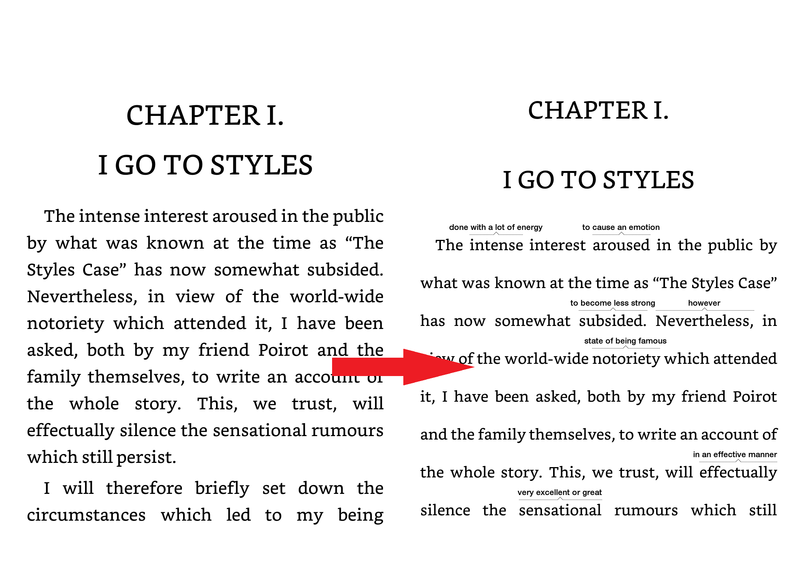

# WiseCreator

[](https://ci.appveyor.com/project/tmilovanov/wisecreator)



## FAQ

- Which book formats are supported?
  - AZW3, MOBI
- What OS do I need to run the tool?
  - Windows, Linux or Mac OS (But for Mac OS you need to follow the usage way, described in "script" paragraph)
- I used this tool but word wise didn't appear on my device, what should I do?
  - Describe what you did and send me your book to timcess@gmail.com

------

## How to use

You can create wordwise enabled books for Amazon Kindle by using
- either [standalone executables](#standalone) or
- [pure python script](#script) (runs faster)

To enable wordwise, the lang meta data of your .mobi files should be set to `eng`. You can use `ebook-meta example.mobi -l eng` to change the meta data.

---

## standalone

1. You need to have [calibre](https://calibre-ebook.com/) on your device.
2. Go to [Releases](https://github.com/tmilovanov/wisecreator/releases) and download wisecreator version for your operating system (`wisecreator.exe` for windows, `wisecreator` for linux)
3. Finally run the below commands in a shell  
    Windows: `wisecreator.exe PATH_TO_YOUR_MOBI_BOOK`   
    Linux &nbsp; &nbsp; &nbsp;: `./wisecreator PATH_TO_YOUR_MOBI_BOOK`

*You can move standalone wisecreator file anywhere you like on your computer, but if you are using calibre portable, make sure you add  your calibre portable folder to the PATH environment variable*  

## script

1.  Install [calibre](https://calibre-ebook.com/)
2.  Download and install [Python3](https://www.python.org/downloads/).
    If your python has been build from source install `pysqlite3` additionally
3.  From this project folder run
```
    python3 -m pip install wheel
    python3 -m pip install .
```
4.  Finally run wisecreator: `python3 -m wisecreator.main PATH_TO_YOUR_BOOK`

---

## Kindle Android app

1. You need to have [root access](https://www.xda-developers.com/root/) to your android phone.
2. Follow the script or executable and get new .mobi and .kll files
3. Rename `LanguageLayer.en.ASIN.kll` to `WordWise.en.ASIN.db`
4. Push the .mobi book to `Android/data/com.amazon.kindle/files`
5. Push the WordWise.en.ASIN.db file to `/data/user/0/com.amazon.kindle/databases`. You need root access for this.
6. set the permissions for the wordwise file by running `chcon u:object_r:app_data_file:s0:c512,c768 [filename].db` from a terminal emulator app or via adb shell at the above path.

---

